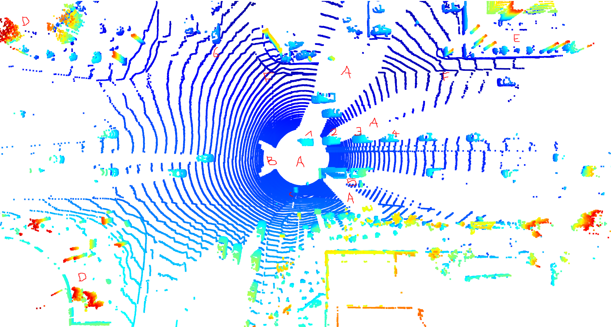
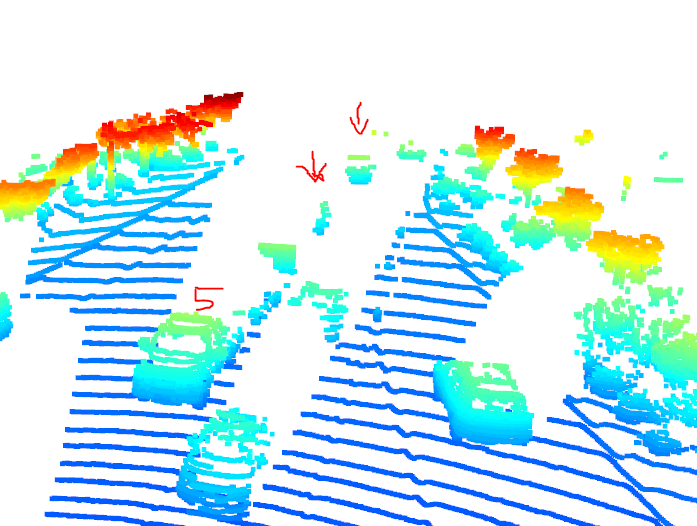

 

 Notes:

 - exec_data is gone and instructions should be updated: Due to changes in boilerplate code - helpers.py under misc, you don't need to pass this parameter any longer. make_exec_list function takes care of it.
 - maybe due to the same change, neither project or step setup mention you also need to adapt the sequence variable to 1, 2 or 3 according to selected sequence
 - min_iou missing in config, and the one func getting configs_det for nothing?
 
----
# Writeup: Visualize point cloud

## Find 10 examples of vehicles with varying degrees of visibility in the point-cloud

**One scene in the beginning: Contains already 6 different examples of cars (1-6) and also amazes how much is well recognizable in the scene in this pointcloud (A-E)**

| Id   |      Description      | 
|----------|:-------------:|
| A | Shadows large shadows caused by closest vehicles, center one by ego vehicle |   |
| B | Intersting shadow effect by the position of the camera and the rear shape of the ego vehicle |
| C | small warning construction sign thing   (interesting to sees the laser through the car windows on 2-3-4 )  |  
| D | high and far away features visiable by y value shading (red) |
| E | detailed garden structure recognizable |
| F | well visible curbs, left going around the curner |
| 1 | vehicle partly obstructed by ego vehicle shape "the front fell off"  |
| 2 | very close and clearly visible front, top and right side  Very tiny and a bit hard to spot in still picture, but due to them stick off still good recognizable tiny point clouds for the mirrors.|
| 3 | Similar visible to 2 |
| 4 | Car with obstructed left front due to 3  also well visible cars at F |
| 5 | Jeep with trailers |
| 6 | 3 cars barely visible (only 1/8th) and with much fewer points due to their distance  |

----

**7: Few far away cars with just their rear visible.**

----

**8: Car following ego vehicle, close but only front and mirrors visible**

----

**9: Very close car to the right shadowed by ego vehicle, only top visible**

----

**10: Big truck but quite obstructed and separated into multiple point clouds due to obstruction by various objects on the central reserve.**

----

**11: Three cars in the rear obstructed in different degrees due to ego vehicle.**

----

**12: Very badly cars shadowed by the jeep and trailer before them, only recognizable by frames before.**

## Try to identify vehicle features that appear stable in most of the inspected examples and describe them
 
- **Mirrors**: Tiny, but due to their shape and sticking off well recognizable on many vehicles.
- **Windows**: Often well visible as "holes" through the vehicle.
- **Tires**: Good recognizable as round shapes if the bottom of the car is not obstructed.
- **General car shape**: Depending on obstruction, but in general also good recognizable is a lower larger box, and a smaller box on top as general shape

----

# Writeup: Track 3D-Objects Over Time

### 1. Write a short recap of the four tracking steps and what you implemented there (filter, track management, association, camera fusion). Which results did you achieve?

#### Extended Kalman Filter (EFK) implementation

Implemented
- F (f is the state transition function; in the linear case, it is a matrix F, also called system matrix)
- covariance matrix Q
Both  needed to be extended from the 2d and 4d versions to the 6d space (because we now have position and velocity in 3 dimensions).
Also implemented S and gamma and filled in predict and update functions as presented in the lectures. Major difference to the lecture material
besides the 6d-extension is that now the track and measurement classes are used to provide x and P respectively the H matrix / hx function.
As suggested we used the general form of the measurement function provided by the sensor class, so that it will also work for the nonlinear camera model.

**Results from applying this step 1 to a simple single-target scenario with lidar only**

#### Track management

- Implemented the initialization of a track, setting position and covariance from the first measurement.
- Implemented decreasing the score of unassigned tracks, deleting a confirmed track if it falls below `params.delete_threshold` or
  an unconfirmed track if it falls to 0, or any track if x or y covariance grows bigger than `params.max_P`
  (As we initialize the score with `1 / params.window` and then de- or increase by this steps, higher than 0 did not seem reasonable).
- Implemented increasing the score of handled tracks and setting them to confirmed if over `params.confirmed_threshold`

**Results from applying tracking (step 2) to a simple single-target scenario with lidar only**

#### Association

- Implemented creating the association matrix, which is the MHD distance of each measurement-track-pair gated by the chi2 distribution (to exclude totally unreasonable pairings ahead)
- Implemented association method that always chooses the minimum distance from the matrix, that is used to find all assignments on nearest neighbor basis until exhausted.

The resulting clip shows 2 confirmed tracks throughout the whole sequence, a third one enters the scene from behind around the middle. Multiple
ghost tracks appear briefly, but get never confirmed and disappear quickly again, too. Towards the end a lot of static vehicles pass by on the right side,
however the lidar does not detect them at all. Forward there are also two more far away cars, only one of those gets briefly detected as a ghost track.

**Results from applying association (step 3) to multi-target tracking scenario with lidar only [video](./img/tracking_results_step3.mp4)**

#### Camera Fusion

- Enabled also taking camera measurements into account, for that implemented their proper initialization and the h(x) function

In contrast to the prior version, this version shows now much less ghost tracks, and those that appear still for a much shorter time.
Integrating the camera had no impact though on the third far away vehicle, and also not on the vehicles to the right that appear at the end of the video, as they
are also not detected by the camera (even if visible and appearing as ground truth). A better camera detection would be needed, on the other hand
those vehicles are not relevant for the current road situation anyway.
The RMSE improved for two of the three tracks, for the closest track it interestingly increased a bit slightly.

**Results from applying association (step 3) to multi-target tracking scenario with lidar and camera fused [video](./img/tracking_results_step4.mp4)**

### 2. Do you see any benefits in camera-lidar fusion compared to lidar-only tracking (in theory and in your concrete results)?

Yes, on the most general level and with fusion done right, it should always be better to have multiple different sensors available, as every sensor has its error and specific deficiencies under certain conditions that the combination of multiple ones can alleviate.
*(Even if some car company claims that humans can also drive with just one sensor == their eyes, one shouldn't forget that the tolerance for machines failing will be less than humans failing, and machines are still a far way off to achieve perception like humans - and on another thought and also personally as a human, the author would have often sought for better ranging capabilities in e.g. dark conditions ;) )*

Cameras are in theory are better at object classification also, while they have deficiencies in precise range measurements. Cameras have it also easier to detect black or highly absorbing objects, or also to prevent false positive of small but very reflective objects.

Concretely in the prior results, the fusion with the camera could prevent and shorten ghost track appearance significantly, and also improved the overall RMSE a bit.

The author would have assumed that it should have also helped with the far away car or the parked cars at the right side. However this did not happen because these objects were also just not detected by the camera, and likely need a better detection (problem in camera detection, not the fusion).

### 3. Which challenges will a sensor fusion system face in real-life scenarios? Did you see any of these challenges in the project?

Most typical problems seen were more on the individual sensor (e.g. ghost tracks coming from wrong lidar detections, or false negatives because the camera not detecting visible vehicels) than the fusion level.
However, the above mentioned third in front but far away car was interesting: With lidar it was mostly not detected, while together with the camera and made a longer ghost track appearance, however it didn't make
it to a confirmed track because the lidar-non-detection downgraded it vs the camera detection.

On another level, building a real product will then also include the permanent engineering challenge to find the best trade offs between many things, e.g.: complexity, runtime performance (we need certain real-time processing), cost, power consumption, and for a car even how much space of the car for all these components gets used.

### 4. Can you think of ways to improve your tracking results in the future?

Integrating more sensors, e.g. long range radar may be interesting to detect more far away vehicles, or while less accurate is maybe more robust in severe weather conditions.
One could also think about adding more sensors of the same type for redundancy / accuracy improvement, e.g. how one can gain 3d vision by combining 2 cameras like two eyes.
Or much simpler, just have multiple cameras to also see to the side and behind.

The tracking itself could also take more prior state and environment into account, e.g. constant velocity is apparently not the reality, but we could also take accelerations
and likely other future behavior of other vehicles or even map data into account, e.g. we know a car heading towards a crossing in a turning lane likely means it will decelerate
and take a turn. Or in pedestrian environments with children nearby, a car might be much more likely to do an emergency braking.

